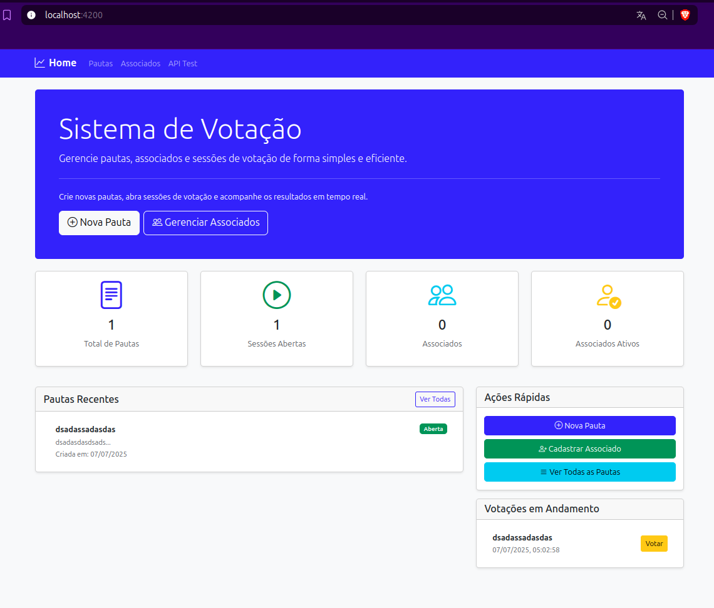
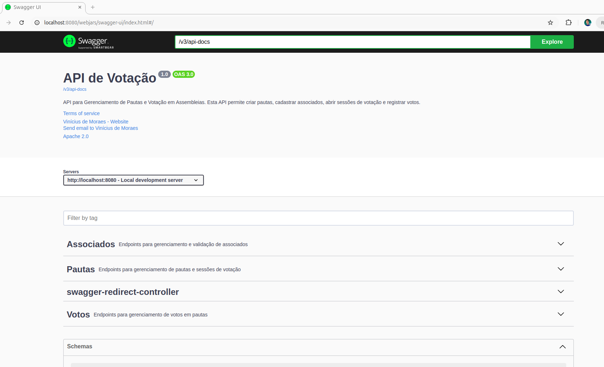

# Sistema de Votação - Documentação (Spring Boot/Angular)

## Descrição

Sistema de votação para cooperativas, onde cada associado possui um voto e as decisões são tomadas em assembleias.

## 🚀 Funcionalidades

### Gestão de Pautas
- ✅ Listar todas as pautas cadastradas
- ✅ Criar novas pautas
- ✅ Visualizar detalhes de uma pauta
- ✅ Abrir sessões de votação
- ✅ Acompanhar status das sessões (aberta/fechada)

### Gestão de Associados
- ✅ Listar associados cadastrados
- ✅ Cadastrar novos associados
- ✅ Validar CPF
- ✅ Ativar/inativar associados
- ✅ Verificar status de votação do CPF
- ✅ Excluir associados

### Sistema de Votação
- ✅ Votar em pautas com sessão aberta
- ✅ Validação de associado habilitado
- ✅ Prevenção de voto duplicado
- ✅ Contabilização de votos em tempo real
- ✅ Visualização de resultados

### Dashboard
- ✅ Visão geral do sistema
- ✅ Estatísticas gerais
- ✅ Ações rápidas
- ✅ Pautas recentes
- ✅ Sessões em andamento

**Preview do Front:**



**Preview do Back (Swagger):**


## Arquitetura e Tecnologias

### Backend
- **Java 21** com **Spring Boot 3.5.3**
- **Arquitetura Reativa** usando WebFlux e MongoDB Reactive
- **MongoDB** para persistência dos dados
- **Swagger/OpenAPI** para documentação da API
- Testes unitários com JUnit e Mockito

### Frontend

- **Angular 19** - Framework principal
- **Bootstrap 5** - Framework CSS para UI responsiva
- **TypeScript** - Tipagem estática
- **RxJS** - Programação reativa
- **Angular Router** - Roteamento
- **Angular Forms** - Formulários reativos
- **HttpClient** - Comunicação com API REST


### Decisões de Implementação

1. **Arquitetura Reativa**
   - Utilizei WebFlux para garantir alta escalabilidade, crucial para cenários com centenas de milhares de votos (tarefa bônus 2)
   - Implementação baseada em eventos, permitindo melhor performance sob carga

2. **Versionamento de API (tarefa bônus 3)**
   - Adotei versionamento via URI path (/api/v1/...)
   - Facilmente identificável pelos clientes
   - Permite evolução da API sem quebrar compatibilidade

3. **Validação de CPF (tarefa bônus 1)**
   - Cliente fake que retorna aleatoriamente se um CPF é válido
   - Integrado ao processo de votação para validar associados

4. **Tratamento de Erros**
   - Handler global de exceções para respostas consistentes
   - Registro de logs detalhados para monitoramento e debugging

5. **Segurança**
   - Conforme solicitado, a segurança foi abstraída para fins de exercício

## Requisitos para Execução do Projeto

- Java 21
- MongoDB (instalado localmente ou via Docker)
- Maven
- Node.js 20+

## Instruções para Execução

### Via docker

##### Iniciar todos os serviços e ferramentas necessárias em segundo plano na Pasta Raiz

```bash
docker compose up -d
```

*Importante:* O docker compose up -d não apenas sobe a aplicação, mas também inicia duas ferramentas de análise de código para ajudar na qualidade e segurança do projeto:

*PMD:* Ferramenta de análise estática de código Java que detecta potenciais bugs, más práticas e problemas de estilo no código-fonte.

*Semgrep:* Ferramenta de análise estática flexível que permite detectar vulnerabilidades, erros comuns e padrões de código indesejados, suportando várias linguagens.

Os containers vão iniciar, mas como o pmd e o semgrep estão configurados com restart: "no" e só rodam o comando de análise uma vez, eles vão subir, executar a análise e sair imediatamente.

Para ver o resultado da execução:

- Listar containers, incluindo os que já pararam

```bash
docker ps -a
```
- Procure os containers com nomes pmd e semgrep (ou IDs correspondentes).

- Ver logs do container PMD

```bash
docker logs pmd
```

Vai mostrar o relatório de análise estática gerado pelo PMD, normalmente listando problemas, más práticas, etc.

- Ver logs do container Semgrep

```bash
docker logs semgrep
```

Vai mostrar as vulnerabilidades ou padrões identificados pelo Semgrep conforme a configuração --config=auto.

#### Resumo prático:

```bash
docker compose up -d

docker logs pmd

docker logs semgrep
```

- Se quiser reexecutar as análises, rode:

```bash
docker compose up pmd
docker compose up semgrep
```

ou ainda:

```bash
docker start -a pmd
docker start -a semgrep
```


#### Apenas com o comando do `docker compose up -d` a api estará disponível em:

``http://localhost:8080/webjars/swagger-ui/index.html``

#### e o front em 
``http://localhost:4200``


### Manualmente

1. **Configurar MongoDB**

   Opção 1: MongoDB Local
   ```bash
   # Instalar MongoDB na máquina local (se já não estiver instalado)
   # Iniciar o serviço do MongoDB
   ```

   Opção 2: MongoDB via Docker
   ```bash
   # Executar o MongoDB via Docker
   docker run -d -p 27017:27017 --name mongodb mongo:latest
   ```

2. **Executar a Aplicação Backend**

   ```bash
   cd ./backend
   ./mvnw clean install
   ./mvnw spring-boot:run
   ```
**Obs: Caso rode o mongodb instalado manualmente deve-se trocar a propertie `spring.data.mongodb.uri=mongodb://mongodb:27017/votacao-db` para**
```java
spring.data.mongodb.uri=mongodb://localhost:27017/votacao-db
```

3. **Acessar a Documentação da API**

   Após iniciar a aplicação, acesse a documentação Swagger:
   ```
   http://localhost:8080/webjars/swagger-ui/index.html
   ```

4. **Executar a Aplicação  Frontend**
  ```bash
  npm i --legacy-peer-deps
  npm run start
  ```

**Aplicação Front estará disponível em http://localhost:4200**

### Volume do MongoDB no Docker Compose

No `docker-compose.yml` deste projeto, o serviço do MongoDB foi configurado com um volume nomeado chamado `mongodb_data`. Veja o trecho correspondente:

```yaml
services:
  mongodb:
    image: mongo
    container_name: mongodb
    ports:
      - "27017:27017"
    volumes:
      - mongodb_data:/data/db
    networks:
      - backend
    healthcheck:
      test: echo 'db.runCommand("ping").ok' | mongosh localhost:27017/votacao-db --quiet
      interval: 10s
      timeout: 10s
      retries: 5
      start_period: 40s

volumes:
  mongodb_data:
```

> Os dados do MongoDB são persistidos automaticamente graças ao volume nomeado `mongodb_data` configurado no `docker-compose.yml`, garantindo que todas as informações sejam salvas no disco do host mesmo após reinicializações ou remoção dos containers, preservando assim o banco de dados do sistema de votação.

## Funcionalidades Implementadas Backend

##### Alguns endpoints foram criatos com pageable para evitar grandes envios de dados e travamentos de sistema.

### Cadastrando uma Pauta

```bash
curl -X POST http://localhost:8080/api/v1/pautas \
  -H "Content-Type: application/json" \
  -d '{"titulo": "Aprovação de Orçamento 2026", "descricao": "Votação para aprovação do orçamento do próximo ano"}'
```

### Abrindo uma Sessão de Votação


```bash
curl -X POST "http://localhost:8080/api/v1/pautas/{PAUTA_ID}/sessao?duracaoMinutos=5"
```

### Registrando um Voto

```bash
curl -X POST http://localhost:8080/api/v1/pautas/{PAUTA_ID}/votos \
  -H "Content-Type: application/json" \
  -d '{"associadoId": "12345678901", "voto": true}'
```

### Verificando o Resultado da Votação

```bash
curl http://localhost:8080/api/v1/pautas/{PAUTA_ID}/votos/resultado
```

## Testes de Performance (Tarefa Bônus 2)

Para simular cenários com muitos votos e garantir performance, recomendo a ferramenta k6 ou Apache JMeter:

### Exemplo com k6

1. Instalar k6: https://k6.io/docs/getting-started/installation/

2. Criar script de teste load-test.js:
```javascript
import http from 'k6/http';
import { check, sleep } from 'k6';

export const options = {
  vus: 1000,      // 1000 usuários virtuais simultâneos
  duration: '20s',
};

const BASE_URL = 'http://localhost:8080/api/v1';

export default function () {
  let res = http.get(`${BASE_URL}/pautas?page=0&size=10`);

  check(res, {
    'status 200': (r) => r.status === 200,
    'retornou JSON': (r) => r.headers['Content-Type'].includes('application/json'),
  });

  // Pausa opcional para simular tempo entre requisições
  sleep(1);
}

```

3. Executar dentro da pasta `k6/` do backend:
```bash
k6 run test-get-pautas.js
```

**Será feita requisições com 1000 usuários simultanêos durante 20s para o endpoint de get pautas.**

## Melhorias Futuras

1. Implementação de autenticação e autorização
2. Notificações em tempo real dos resultados
3. Expansão da API com mais endpoints para gestão de associados
4. Implementação de métricas e dashboards para monitoramento

## Funcionalidades Implementadas Frontend

## 🎨 Interface do Usuário

### Design System
- **Cores**: Bootstrap color palette
- **Tipografia**: Inter font family
- **Componentes**: Bootstrap components
- **Responsividade**: Mobile-first design
- **Iconografia**: Bootstrap Icons

### Funcionalidades da Interface

#### Dashboard
- Cards com estatísticas do sistema
- Lista de pautas recentes
- Ações rápidas
- Indicadores de sessões ativas

#### Gestão de Pautas
- Grid responsivo de cards
- Badges de status (sessão aberta/fechada)
- Botões contextuais baseados no estado
- Modal de resultados em tempo real

#### Sistema de Votação
- Interface intuitiva com botões grandes
- Validação em tempo real
- Feedback visual de confirmação
- Prevenção de erros de usuário

#### Gestão de Associados
- Tabela responsiva
- Formulário inline para cadastro
- Ações em grupo (ativar/inativar/excluir)
- Validação de CPF


### Tratamento de Erros
- Interceptação de erros HTTP
- Mensagens de feedback para o usuário
- Validação de formulários
- Estados de loading

## 📱 Responsividade

A aplicação é totalmente responsiva e funciona em:
- 📱 Mobile (320px+)
- 📟 Tablet (768px+)
- 💻 Desktop (1024px+)
- 🖥️ Large screens (1200px+)

## 🔒 Validações

### Formulários
- **CPF**: Formato e dígitos verificadores
- **Pautas**: Título e descrição obrigatórios
- **Votação**: Seleção de associado e voto obrigatórios

### Regras de Negócio
- Associado só pode votar uma vez por pauta
- Apenas associados ativos podem votar
- Votação só permitida em sessões abertas
- CPF único por associado


### Melhorias Planejadas
- [ ] Autenticação e autorização
- [ ] Notificações em tempo real (WebSocket)
- [ ] Relatórios e analytics
- [ ] Histórico de votações
- [ ] Configurações de sistema
- [ ] Temas personalizáveis
- [ ] PWA (Progressive Web App)


### Padrões Utilizados
- **Standalone Components** - Arquitetura moderna do Angular
- **Reactive Forms** - Formulários tipados e validados
- **Observables** - Programação reativa com RxJS
- **Service Pattern** - Separação de responsabilidades
- **Dependency Injection** - Inversão de controle

### Tratamento de Respostas HTTP
- **200-299** - Sucesso com feedback visual
- **400** - Dados inválidos com validação
- **401/403** - Não autorizado
- **404** - Recurso não encontrado
- **409** - Conflito (CPF duplicado, voto duplicado)
- **500** - Erro interno do servidor

## 🧪 Validações Implementadas

### Validações de Frontend
- **CPF** - Algoritmo de validação de dígitos verificadores
- **Formulários** - Campos obrigatórios e formatos
- **Sessões** - Verificação de status antes de votar
- **Duplicação** - Prevenção de votos duplicados

### Regras de Negócio
- Associado só pode votar uma vez por pauta
- Apenas associados ativos podem votar
- Votação só em sessões abertas
- CPF único por associado

## 📱 Responsividade

### Breakpoints
- **Mobile** - 320px a 767px
- **Tablet** - 768px a 1023px
- **Desktop** - 1024px a 1199px
- **Large** - 1200px+

### Adaptações por Dispositivo
- **Mobile** - Cards empilhados, botões grandes
- **Tablet** - Grid 2 colunas, navegação collapse
- **Desktop** - Grid 3-4 colunas, sidebar fixa

## 🔒 Segurança e Boas Práticas

### Implementadas
- **Sanitização** - Proteção contra XSS
- **Tipagem** - TypeScript strict mode
- **Validação** - Client-side e server-side
- **Error Handling** - Interceptors globais
- **Environment** - Configurações por ambiente

### Otimizações Implementadas
- **Lazy Loading** - Componentes carregados sob demanda
- **OnPush Strategy** - Change detection otimizada
- **Tree Shaking** - Bundle size otimizado
- **Standalone Components** - Menor bundle size

## 📈 Métricas de Qualidade

### Code Quality
- **TypeScript** - Strict mode ativado
- **ESLint** - Padrões de código
- **Prettier** - Formatação consistente
- **Componentização** - Alta reutilização

**Foi criado uma page para teste da app seguindo um fluxo, um guia de como usar foi feito abaixo:**

# Guia do Teste Sequencial Completo

## 📋 Visão Geral

O componente `api-test` do Front implementa um teste sequencial completo que executa toda a funcionalidade principal do sistema de votação em uma única sequência automatizada.

## 🚀 Como Executar o Teste

1. **Inicie o backend e Frontend com o `docker compose up -d`**
3. **Acesse** `http://localhost:4200/api-test`
4. **Clique** no botão "Iniciar Teste Completo"

## 🔄 Sequência do Teste

O teste executa automaticamente os seguintes passos:

### 1. 🔍 Verificação de Conexão
- Testa se a API está respondendo
- Endpoint: `GET /api/v1/pautas`

### 2. 👤 Criação de Associado
- Gera um CPF válido automaticamente
- Cria um novo associado
- Endpoint: `POST /api/v1/associados`

### 3. ✅ Verificação do Associado
- Confirma se o associado foi criado corretamente
- Endpoint: `GET /api/v1/associados/{id}`

### 4. 📋 Criação de Pauta
- Cria uma nova pauta com título e descrição automáticos
- Endpoint: `POST /api/v1/pautas`

### 5. ✅ Verificação da Pauta
- Confirma se a pauta foi criada corretamente
- Endpoint: `GET /api/v1/pautas/{id}`

### 6. 🚀 Abertura de Sessão
- Abre uma sessão de votação para a pauta criada
- Duração: 5 minutos
- Endpoint: `PUT /api/v1/pautas/{id}/abrir-sessao?duracaoMinutos=5`

### 7. 🗳️ Registro de Voto
- Registra um voto "SIM" do associado criado na pauta
- Endpoint: `POST /api/v1/pautas/{id}/votos`

## 📊 Resultados do Teste

### ✅ Sucesso
- Cada passo exibe um log com ✅ indicando sucesso
- Dados detalhados são mostrados no JSON de resposta
- Ao final: "🎉 TESTE COMPLETO - Todos os testes foram executados com sucesso!"

### ❌ Erro
- Passos com erro exibem ❌ com detalhes do problema
- O teste para na primeira falha
- Informações de debug são disponibilizadas

## 🔧 Funcionalidades Adicionais

### Testes Individuais
- **Teste de Voto Individual**: Testa envio de voto com IDs fixos
- **Teste de Listagem**: Lista todas as pautas existentes

### Geração de CPF
- CPF válido gerado automaticamente usando algoritmo de validação
- Cada execução cria um associado único

### Logs Detalhados
- Cada etapa é logada no console do navegador
- Interface mostra progresso em tempo real
- Dados de resposta da API são exibidos

## 🎯 Objetivo do Teste

Este teste valida de forma automatizada:

1. **Conectividade** entre frontend e backend
2. **CRUD de Associados** (Create + Read)
3. **CRUD de Pautas** (Create + Read)
4. **Abertura de Sessões** de votação
5. **Registro de Votos** com validações
6. **Fluxo completo** end-to-end do sistema

## 📝 Observações

- O teste usa dados reais criados dinamicamente
- Cada execução cria novos registros no banco
- É recomendado limpar dados de teste periodicamente
- Logs detalhados facilitam debugging de problemas

## 🚨 Requisitos

- Backend Spring Boot rodando na porta 8080
- API endpoints implementados conforme OpenAPI spec
- Banco de dados configurado e acessível
- CORS configurado para permitir requisições do frontend
